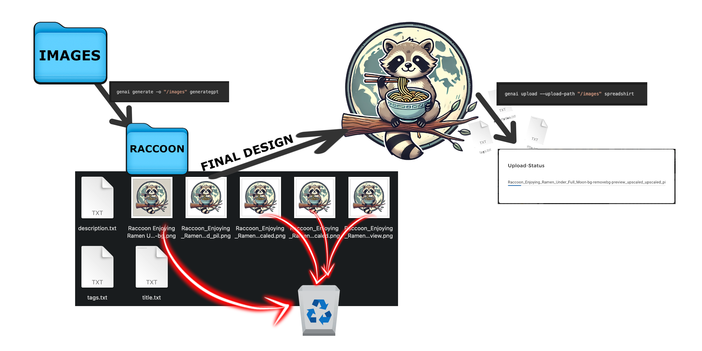

# GenAI-PoD: Your Command-Line Solution for AI Image Generation & Webshop Automation

> **Automate your entire print-on-demand workflow— from AI-driven image creation
> to uploads on leading platforms like Spreadshirt & Redbubble.**

<div align="center">

[](./LICENSE)
[](https://shields.io/)

[](https://github.com/leonhardschwertfeger/genai/actions/workflows/cicd.yaml)
[](https://github.com/astral-sh/ruff)
[](https://mypy-lang.org/)

[](https://github.com/leonhardschwertfeger/genai/releases)
[](https://doi.org/10.5281/zenodo.14569412)

</div>

## ⚠️ Disclaimer

> This software is provided “as is” without any warranty of reliability,
> functionality, or fitness for a specific purpose. Any use, especially in
> production environments, is at your own risk. Automated interactions may
> violate the terms of service of OpenAI, Spreadshirt, Redbubble, remove.bg, or
> bigjpg.com—always check them beforehand. This project is an unofficial tool,
> not affiliated with or endorsed by these platforms. The authors assume no
> liability for policy breaches, account suspensions, financial losses, legal
> consequences, or other damages. As interfaces and policies can change
> frequently, regular updates or patches may be required.

## Introduction

**GenAI-PoD** is a versatile command-line tool that streamlines **image generation**
and **webshop integration**. By leveraging **ChatGPT** (via Selenium
automation), it can programmatically create images, apply **background
removal**, perform **upscaling**, and finally **publish** these designs on
popular print-on-demand (POD) platforms such as **Spreadshirt** and
**Redbubble**.

**Key highlights** of GenAI-PoD include:

- **Direct ChatGPT Integration** Generate AI-driven designs or concept art using
  your **OpenAI** account via automated browser interactions.

- **One-Stop Workflow** Automatically remove backgrounds
  ([remove.bg](https://www.remove.bg/)) and upscale images
  ([bigjpg.com](https://bigjpg.com/)) without leaving the command-line.

- **Seamless Uploads** Eliminate manual steps: GenAI-PoD can log you in, navigate to
  forms, fill out metadata (titles, tags, descriptions), and publish your new
  designs directly to your connected Spreadshirt/Redbubble storefronts.

- **Automated Account Verification** Manage user sessions and cookies to remain
  logged in across different services, reducing repetitive sign-ins.

- **Stable & Extensible** Built with maintainability in mind, the codebase
  follows robust design patterns that simplify adding new providers, image
  processing steps, or customization.

---

## Features

- **Background Removal** Automates background removal via Selenium on
  [remove.bg](https://www.remove.bg/).

- **Image Upscaling** Upscales images via Selenium on
  [bigjpg.com](https://bigjpg.com/).

- **Automatic Upload** Integrates with major POD sites:

  - [Spreadshirt](https://www.spreadshirt.de)
  - [Redbubble](https://www.redbubble.com)

- **AI Image Generation** Generates images using the **official ChatGPT**
  website in a browser automation workflow.

- **Account Verification** Streamlines verifying accounts and managing sessions
  so you can stay logged in for repeated tasks.

- **CLI-Centric** Provides a powerful command-line interface for both
  **experienced** and **casual** CLI users.

---

## Installation

1. **Clone the Repository**

   ```bash
   git clone https://github.com/LeonhardSchwertfeger/genai.git
   ```

2. **Create a Virtual Environment (Recommended)**

   ```bash
   python -m venv venv
   source venv/bin/activate  # On Windows use `venv\Scripts\activate`
   ```

3. **Install Dependencies** Install required Python packages:
   ```bash
   pip install -e ".[dev,test]" # On Windows use `make dev`
   ```

## Prerequisites

- [Python](https://www.python.org/): Version 3.11 or later.
- [ChatGPT Premium account](https://openai.com/chatgpt/pricing/)
- [Chrome Browser](https://www.google.com/intl/en_en/chrome): Required for web
  automation tasks.
- [Chrome
  WebDriver](https://developer.chrome.com/docs/chromedriver/downloads?hl=en/):
  Compatible with your installed Chrome version (used by Selenium).
- **Verifying accounts**: see under Commands/verifysites SITE

## Usage

### General Usage

Run the tool using:

```bash
genai [OPTIONS] COMMAND
```

To display help information:

```bash
genai --help
```

### Global Options

- `-h`, `--help`: Show help information and exit.
- `--version`: Show the version and exit.

### Commands

#### `verifysite`

Verify account in Chrome for specific websites (e.g., OpenAI, Spreadshirt).
Usage:

```bash
genai verifysite SITE
```

Options for `SITE`:

- `capsolver`: profile to add [CAPTCHA
  Solver](https://chromewebstore.google.com/detail/captcha-solver-auto-hcapt/hlifkpholllijblknnmbfagnkjneagid?hl=en-US)
  extension to chrome browser
- `ChatGPT`: profile to log in to chat.openai.com
- `Spreadshirt`: profile to log in to spreadshirt or Redbubble

after you have logged in in your account, you can type DONE in the console and
the settings will be saved

#### `generate`

Generate and save AI-generated images to disk. Usage:

```bash
genai generate [OPTIONS] SUBCOMMAND [ARGS]...
```

Options for `generate`:

- `-o`, `--output-directory TEXT`: The directory to save the images and metadata
  to (required).

Subcommands:

- `generategpt`: Generate images using GPT through selenium.


#### `upload`

Upload images to web shops. Usage:

```bash
genai upload [OPTIONS] SUBCOMMAND [ARGS]...
```

Options for `upload`:

- `--upload-path TEXT`: The directory containing sub-directories with images to
  upload (required). Subcommands:
- `spreadshirt`: Upload images to Spreadshirt.
- `redbubble`: Upload images to Redbubble.

## Detailed Web Shop Usage Guide

### Spreadshirt Usage

1. **Verify Account**

Start by verifying your Spreadshirt account using the command:

```bash
genai verifysite Spreadshirt
```

This will open a Chrome window for you to log in. Once done, type `DONE` in the
console to save the session.

2. **Using Product Templates**

- Create a product template directly on Spreadshirt if needed. The tool will
  automatically use the most recently created template for uploads.
- The template **must contain** at least **50 products**

3. **Organizing Uploaded Files**

- Successfully uploaded designs are moved to the `used_spreadshirt` folder.
- Any designs with upload errors are moved to the `error_spreadshirt` folder for
  review.

### Redbubble Usage

1. **Verify Account**

- Start by verifying your Redbubble account with the following command:

```bash
genai verifysite Spreadshirt
```

- Alternatively, for first-time use, initiate the upload command, which will
  prompt for a login:

```bash
genai upload --upload-path "./images" redbubble
```

Once logged in, your session credentials are saved for future uploads.

2. **Redbubble Account Settings**

- Your Redbubble account must be set to `English` as the display language and
  use `$ United States Dollar (USD)` as the currency. These can be adjusted in
  your Redbubble account settings at the bottom of the webpage.

3. **Setting up the scaling settings**

- In the schling_adjustments.json the desired products can be switched on and
  off

4. **Organizing Uploaded Files**

- Successfully uploaded designs are moved to the `used_redbubble` folder.
- Any designs with upload errors are moved to the `error_redbubble` folder for
  review.

### ChatGPT Usage

1. **Verify Account**

- To use ChatGPT for generating images via web automation, first verify your
  account:

```bash
genai verifysite ChatGPT
```

- This will store your login session, enabling seamless automation with ChatGPT.

## Examples



- **Generate images using GPT via web automation**:

  ```bash
  genai generate --output-directory ./images generategpt
  ```

- **Upload images from a directory to Spreadshirt**:

  ```bash
  genai upload --upload-path ./images spreadshirt
  ```


- **Verify OpenAI account in Chrome**:
  ```bash
  genai verifysites capsolver
  ```

## Performance

### Generate GPT Images

The `generategpt` command typically takes around 11 minutes to complete. This
duration includes the time required for AI-driven image creation, background
removal, and upscaling processes.

### Upload to Spreadshirt

Uploading images to Spreadshirt using the `upload spreadshirt` command generally
takes about 1 minute per batch of images. This includes logging in, navigating
to the upload form, filling out metadata, and publishing the designs.

## License

This project is licensed under the [GPL-3.0-or-later](./LICENSE).

## Acknowledgements

- [Selenium](https://www.selenium.dev) for web automation.
- [Cloup](https://cloup.readthedocs.io) for the command-line interface.
- [Tor Project](https://www.torproject.org) for anonymous connections.
- [undetected-chromedriver](https://github.com/ultrafunkamsterdam/undetected-chromedriver)
  for web automation.
- [remove.bg](https://www.remove.bg) for background removal services.
- [bigjpg](https://bigjpg.com) for image upscaling services.

## Disclaimer

### Educational Purpose Only

This project is intended solely as an example of how web automation, automated
image generation, and uploading processes can be implemented using tools like
Selenium and various AI models. It is provided for educational and informational
purposes to demonstrate the capabilities of these technologies.

### Compliance with Terms of Service

Users must ensure that their use of this tool complies with the terms of
service, policies, and guidelines of the websites and services it interacts
with, including but not limited to Spreadshirt, Redbubble, OpenAI, and any other
platforms involved. Automated interactions with these services may be restricted
or prohibited, and users are solely responsible for adhering to all applicable
rules and regulations.

### No Endorsement or Liability

The authors and contributors of this project do not endorse or support any
activities that violate the terms of service of third-party websites or
services. By using this tool, you agree that you are solely responsible for any
actions taken and that the authors cannot be held liable for any misuse,
damages, or legal consequences arising from its use.

### Respect for Web Platforms

Automated tools can place significant load on web services and may disrupt
normal operations. Users should exercise caution and respect when using
automation tools to interact with websites, ensuring that their actions do not
negatively impact the functionality or availability of these platforms for
others.

### Ethical Considerations

We encourage all users to consider the ethical implications of automating
interactions with web services. Misuse of automation tools can lead to
unintended consequences, including the spread of misinformation, unauthorized
access to services, and potential harm to individuals or organizations.

## Credits

The login function in `from generate_gpt.py` is based on code from the
open-source project
[ChatGPT-unofficial-api-selenium](https://github.com/Priyanshu-hawk/ChatGPT-unofficial-api-selenium/tree/5a258b9db844ae13da633591568790460d82524b),
licensed under the MIT License. Special thanks to the project authors for making
their code available. Date of inclusion: May 15, 2024
